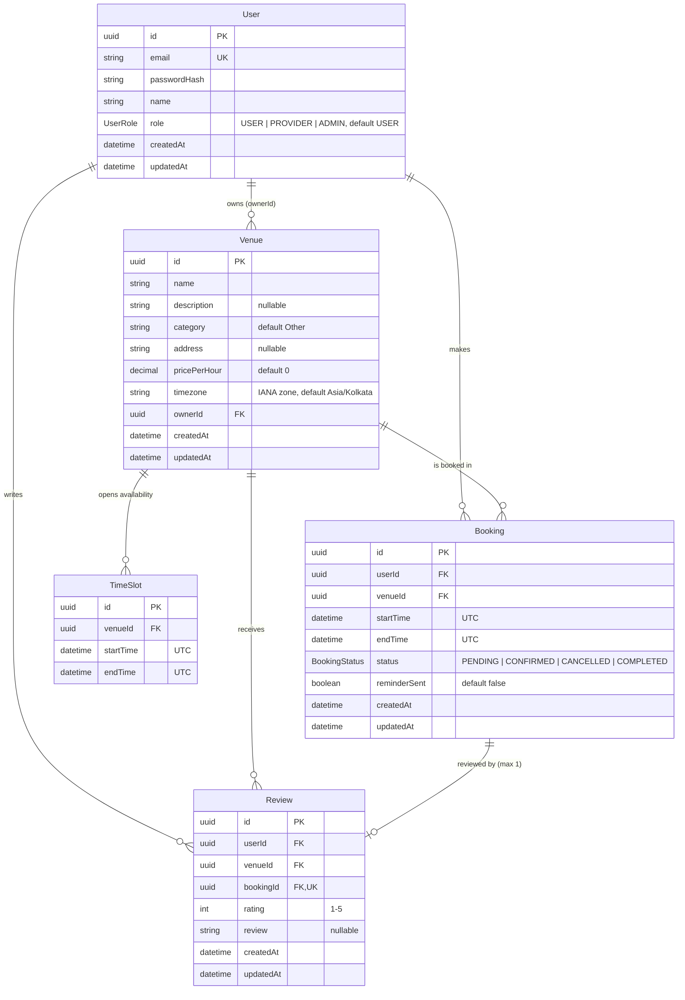

# BookIt — Data Model

Source of truth: [`server/prisma/schema.prisma`](../server/prisma/schema.prisma) plus the SQL-only constraints in
[`20260923000000_booking_overlap_constraints`](../server/prisma/migrations/20260923000000_booking_overlap_constraints/migration.sql).
Update this file whenever the schema changes.

## How the pieces fit

- **Venue owner.** A venue belongs to a user with the `PROVIDER` (or `ADMIN`) role. There is no separate provider table.
- **TimeSlot is an availability window, not a bookable unit.** A provider opens e.g. 06:00–23:00; a booking is valid if it
  fits entirely inside one slot of that venue. Bookings do **not** reference a slot, so one slot can hold many
  back-to-back bookings.
- **Review** is tied to exactly one `COMPLETED` booking (`bookingId` is unique). `userId` and `venueId` are copied from
  the booking so reviews can be listed per venue and per user without joins.
- **Times** are stored in UTC. `Venue.timezone` is used to show and enter times in the venue's local time (emails and UI).

## Constraints the schema file can't show

Prisma can't express these, so they live in raw SQL in the migration (requires the `btree_gist` extension):

| Constraint | Table | Rule |
|---|---|---|
| `Booking_no_overlap` | Booking | No two bookings for the same venue may overlap while both are `PENDING` or `CONFIRMED`. Ranges are half-open `[start, end)`, so back-to-back bookings (10–11, 11–12) are allowed. Cancelled/completed bookings don't block. |
| `TimeSlot_no_overlap` | TimeSlot | No two slots for the same venue may overlap. |

The booking service also checks for overlaps inside a transaction to return a friendly `409`; the constraint is what
guarantees correctness when requests race (see `server/tests/booking.concurrency.test.ts`).

## Indexes

| Table | Index | Used by |
|---|---|---|
| Booking | `(venueId, startTime, endTime)` | overlap checks, venue schedules |
| Booking | `(userId, createdAt)` | "My bookings" list |
| TimeSlot | `(venueId, startTime)` | venue availability |
| Review | `(venueId)`, `(userId)` | venue ratings, user reviews |

## Deletion rules

Foreign keys use the default `RESTRICT`: a venue that still has bookings, slots or reviews cannot be deleted (the API
returns `409`). Users are never deleted by the API.
