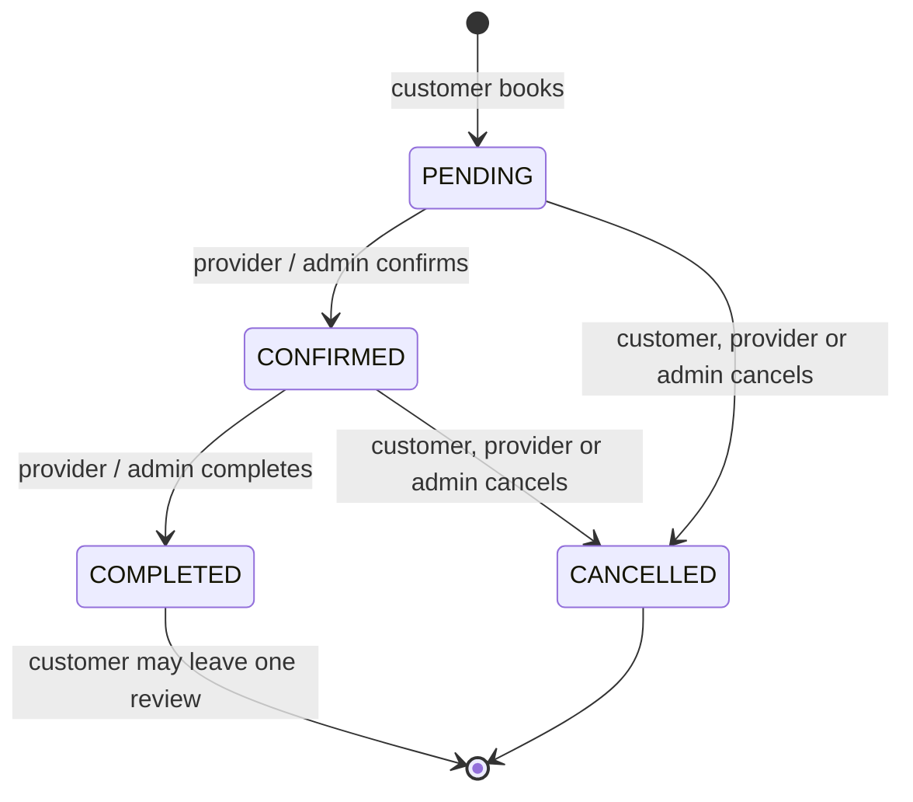

# Booking Lifecycle

| Transition | Endpoint | Who | Side effects |
|---|---|---|---|
| → `PENDING` | `POST /api/bookings` | any logged-in user | holds the time (blocks overlapping bookings); `bookingCreated` socket event |
| `PENDING` → `CONFIRMED` | `PATCH /api/bookings/:id/confirm` | venue owner, admin | confirmation email; `bookingConfirmed` event; 24h reminder email later |
| `CONFIRMED` → `COMPLETED` | `PATCH /api/bookings/:id/complete` | venue owner, admin | `bookingCompleted` event; customer can now review |
| `PENDING`/`CONFIRMED` → `CANCELLED` | `PATCH /api/bookings/:id/cancel` | the customer, venue owner, admin | frees the time; cancellation email; `bookingCancelled` event |

Any other transition returns `409 Conflict`. Socket events go only to the customer, the venue owner and admins; viewers
of the venue page get an anonymous `venueAvailabilityChanged` ping.

Planned: automatic expiry of stale `PENDING` bookings and auto-complete after the end time (Phase 2);
`AWAITING_PAYMENT` / `REFUNDED` states (Phase 8).
